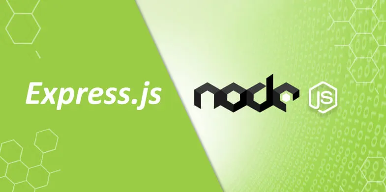
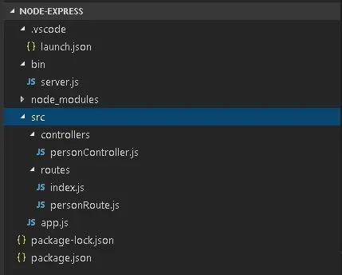
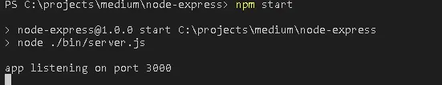
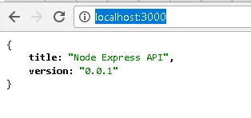

# apifast-node
Fast mode to build API en Nodejs
 

  

Para quem não conhece o Express.js ele é um excelente framework do Node.js que nos auxilia na construção das nossas aplicações Web. Ele é um framework muito simples de ser utilizado, por isso vem sendo adotado pelos desenvolvedores de todos os níveis. Para que possamos conhecer ele um pouco mais vejamos 10 passos a baixo para criação de um Web Site.

1. Instalação
Para esse artigo não iremos abordar a instalação do Node.js, iremos partir de uma maquina com ele já instalado e configurado. Crie um novo diretório no seu computador e crie uma nova pasta, nós iremos utilizar node-express, mas você pode escolher um outro nome de sua preferência. Feito isso execute o comando a baixo para baixar o nosso modulo.

npm install express

2. Configuração
Agora nós precisamos criar o nosso arquivo package.json, esse é o arquivo de ponto de partido dos nossos projetos Node. Para isso, execute o comando a baixo, ele irá criar o nosso arquivo com a referencia do module express.

npm init -y

3. Estrutura do nosso projeto
Crie uma estrutura de pastas e arquivos conforme está na imagem a baixo:

  

4. Criando arquivo de Server
Vamos agora criar o arquivo de inicialização do nosso projeto, para quem vem do mundo php seria o nosso index.php ou HomeController.cs no MVC do .NET. Para isso, abra o seu arquivo server.js e cole o código a baixo nele:

 

> [!NOTE]
>const app = require('../src/app'); 
>const port = normalizaPort(process.env.PORT || '3000'); 
>function normalizaPort(val) { 
>    const port = parseInt(val, 10); 
>    if (isNaN(port)) { 
>        return val; 
>    } 
>if (port >= 0) { 
>        return port; 
>    } 
>return false; 
>} 
>app.listen(port, function () { 
>    console.log(`app listening on port ${port}`) 
>}) 

 
No código a cima nós estamos importando um modulo que iremos criar nos próximos passos, depois estamos definindo uma porta para que ele seja executado, no final estamos passando para o método app.listen a porta que queremos que ele escute o nosso projeto e de um console.log com ela.

5. Controller
Para que possamos organizar o nosso código, nós dividimos ele pensando em um padrão MVC, no código a baixo nós temos as nossas Actions das nossas Controllers. 

> [!NOTE]
>exports.post = (req, res, next) => { 
>    res.status(201).send('Requisição recebida com sucesso!'); 
>}; 
>exports.put = (req, res, next) => { 
>    let id = req.params.id; 
>    res.status(201).send(`Requisição recebida com sucesso! ${id}`); 
>}; 
>exports.delete = (req, res, next) => { 
>    let id = req.params.id; 
>    res.status(200).send(`Requisição recebida com sucesso! ${id}`); 
>}; 

6. Rotas
Agora vamos criar as nossas rotas, nessa parte nós temos dois arquivos: index.js e personRoute.js. O arquivo index.js seria para passar a versão que esta a nossa API ou para que possamos passar para um balanceador (Load Balancer) verificar se a nossa API está no ar, o personRoute.js contem as rotas que iremos utilizar para nossa PersonController. 

Index.js

> [!NOTE]
>const express = require('express'); 
>const router = express.Router(); 
>router.get('/', function (req, res, next) { 
>    res.status(200).send({ 
>        title: "Node Express API", 
>        version: "0.0.1" 
>    }); 
>}); 
>module.exports = router;  

PersonRoute

> [!NOTE]
>const express = require('express'); 
>const router = express.Router(); 
>const controller = require('../controllers/personController') 
>router.post('/', controller.post); 
>router.put('/:id', controller.put); 
>router.delete('/:id', controller.delete); 
>module.exports = router; 
 
7. Configurações. 

O arquivo app.js é responsável pelas configurações do nosso projeto, nele que nós devemos configurar a nossa base de dados, rotas … etc. Pensando novamente no mundo .NET eu ousaria dizer que ele seria o nosso web.config. 

> [!NOTE]
>const express = require('express'); 
>const app = express(); 
>app.use(express.json()); 
>const router = express.Router(); 
>//Rotas 
>const index = require('./routes/index'); 
>const personRoute = require('./routes/personRoute'); 
>app.use('/', index); 
>app.use('/persons', personRoute); 
>module.exports = app;  

8. Nodemon 

O pacote nodemon nós auxilia no momento do nosso desenvolvimento, com ele nós não precisamos dar stop e subir novamente a nossa APP, ele verifica que ocorreu uma alteração e já faz o refresh automaticamente. Para instalar ele, execute o comando a baixo na sua console.  

npm install -g nodemon  

9. Arquivo Package.config 

Esse seria o arquivo inicial nos projetos Node, nele nós temos todas as dependência 

> [!NOTE]
>{ 
>  "name": "node-express", 
>  "version": "1.0.0", 
> "description": "", 
>  "main": "index.js", 
>  "dependencies": { 
>    "express": "^4.15.4" 
>  }, 
>  "devDependencies": {}, 
>  "scripts": { 
>    "test": "echo \"Error: no test specified\" && exit 1", 
>    "start": "npx nodemon ./bin/server.js" 
>  }, 
>  "keywords": [], 
>  "author": "", 
>  "license": "ISC" 
> }  

Rode o comando: npm install

e depois

npx nodemon ./bin/server.js

10. Testes 

Para que possamos testar o nosso projeto, digite o comando npm install na sua console para importar os pacotes necessários para a nossa aplicação, assim que ele finalizar execute o comando npm start. Caso tudo OK nos passos anteriores, você irá ver a mensagem a baixo na sua console.

  

Agora abra no seu navegador o endereço http://localhost:3000/. Ele deve apresentar a mensagem a baixo como retorno da nossa rota Index.

  

Obs: olhe dentro do app.js verá '/person' que é usada na url para testar a API, exeplo: http://localhost:3000/persons/1
